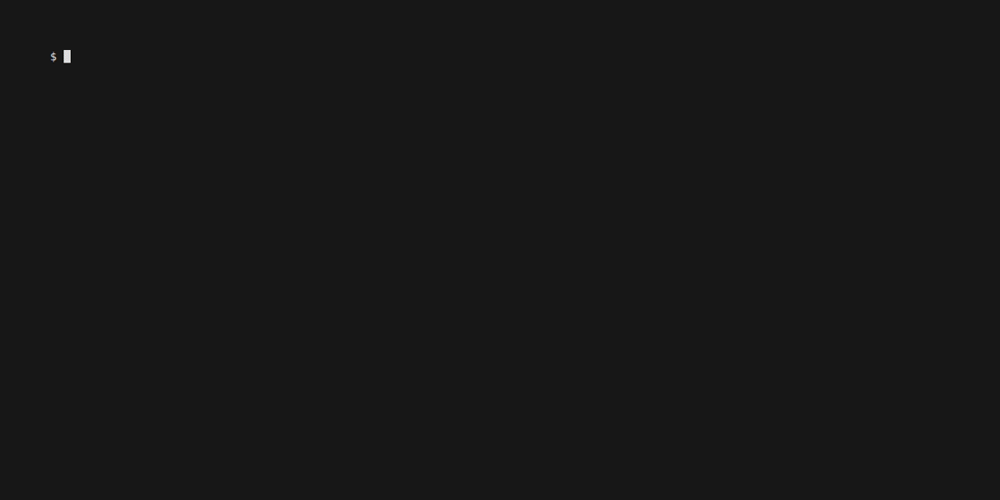
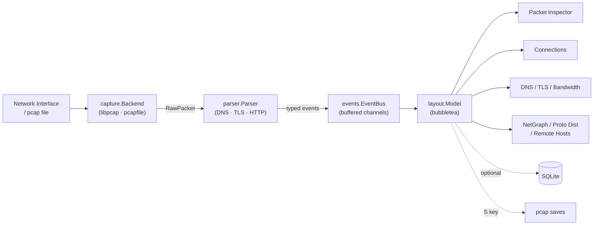

<p align="center">
  
</p>

<h1 align="center">pkty</h1>

<p align="center">
  <a href="https://github.com/srixivas/pkty/actions/workflows/ci.yml">
    
  </a>
  <a href="https://github.com/srixivas/pkty/releases/latest">
    
  </a>
  <a href="LICENSE">
    
  </a>
</p>

<p align="center">
  
</p>

A real-time terminal network dashboard for macOS and Linux. Captures live traffic via libpcap (or reads pcap files offline) and renders a multi-panel TUI with packet inspection, DNS, TLS, connections, bandwidth, and protocol analytics — all in one view.

```
sudo pkty -i en0
```

> See [DEV.md](DEV.md) for architecture details, dev setup, and contributing.

---

## Features

- Live capture via libpcap or offline pcap/pcapng replay
- Packet inspector — list → protocol detail tree → hex dump
- Connections, DNS queries, TLS/SNI, bandwidth sparkline, protocol distribution
- ASCII network diagram with per-host TX/RX bars (`n` to toggle)
- Display filters — press `Enter` on any row in any widget to filter live
- BPF filter bar (`/`) for kernel-level capture filtering
- Reverse DNS resolution (PTR lookups, seeded from observed DNS traffic)
- Save captures to pcap (`S` key) or log continuously to SQLite (`--sqlite`)

---

## Architecture



---

## Layout

```
┌──────────────────────────────────────────────────────────────────────────────┐
│ Display: ◆ all traffic                                       [filter bar]    │
├──────────────────┬───────────────────────────────┬──────────────────────────┤
│  Connections [2] │   Packet Inspector [1]         │   DNS Queries      [3]   │
│                  │   ├── Packet List (scroll)     │                          │
│  IP:port  bytes  │   ├── Detail Tree (layers)     │   Name   Type  Resolved  │
│  ...             │   └── Hex Dump                 │   ...                    │
│                  │                                ├──────────────────────────┤
│                  │                                │   Bandwidth              │
│                  │                                │   ▁▃▅▇ TX/RX            │
├──────────────────┴───────────────────────────────┴──────────────────────────┤
│  Proto Dist [4]        │  Remote Hosts [4+Tab]      │  TLS Inspector [4+Tab] │
│  TCP ████████  60.2%   │  google.com    10.5M ███   │  SNI     Ver   Cipher  │
│  UDP ████     20.1%    │  1.2.3.4        2.1M ██    │  ...                   │
├──────────────────────────────────────────────────────────────────────────────┤
│ pkty · Packets: 1234 · [Packets] · Focus: Centre                            │
└──────────────────────────────────────────────────────────────────────────────┘
```

---

## Installation

### Pre-built binary (recommended)

Download from the [Releases](https://github.com/srixivas/pkty/releases) page and move to your `$PATH`:

```bash
# macOS (Apple Silicon)
curl -L https://github.com/srixivas/pkty/releases/latest/download/pkty_darwin_arm64.tar.gz | tar xz
sudo mv pkty /usr/local/bin/

# macOS (Intel)
curl -L https://github.com/srixivas/pkty/releases/latest/download/pkty_darwin_amd64.tar.gz | tar xz
sudo mv pkty /usr/local/bin/

# Linux (x86-64)
curl -L https://github.com/srixivas/pkty/releases/latest/download/pkty_linux_amd64.tar.gz | tar xz
sudo mv pkty /usr/local/bin/
```

### Build from source

```bash
git clone https://github.com/srixivas/pkty
cd pkty
go build -o pkty ./cmd/pkty
```

Requires Go 1.19+, CGO enabled, and libpcap headers (`libpcap-dev` on Linux; included on macOS).

### Prerequisites

| Platform | Requirement |
|----------|-------------|
| macOS | Nothing extra — libpcap ships with the OS |
| Linux | `sudo apt install libpcap-dev` (Debian/Ubuntu) · `sudo dnf install libpcap-devel` (Fedora) |
| Both | Run as root or grant `cap_net_raw` (see below) |

**Linux — run without sudo:**
```bash
sudo setcap cap_net_raw+ep ./pkty
./pkty -i eth0
```

---

## Usage

```bash
sudo pkty -i en0                          # live capture
pkty -r capture.pcap                      # offline replay
sudo pkty -i en0 -f "tcp port 443"        # with BPF pre-filter
sudo pkty -i en0 --sqlite                 # + continuous SQLite logging
sudo pkty -i en0 --sqlite-db ~/live.db    # custom db path
pkty -version
```

---

## Key Bindings

| Key | Action |
|-----|--------|
| `1` | Focus Packet Inspector (centre) |
| `2` | Focus Connections (left) |
| `3` | Focus DNS Queries (right) |
| `4` | Focus bottom panel |
| `Tab` | Cycle bottom sub-panels: Proto Dist → Remote Hosts → TLS |
| `Tab` | In centre: cycle Packets → Detail Tree → Hex Dump |
| `n` | Toggle centre: Packet Inspector ↔ Network Diagram |
| `j` / `↓` | Down in focused widget |
| `k` / `↑` | Up in focused widget |
| `Enter` | Toggle display filter from focused row |
| `D` | Clear all display filters |
| `S` | Save captured packets to pcap file |
| `/` | Open BPF filter bar |
| `q` / `Ctrl+C` | Quit |

---

## Display Filters

Press `Enter` on any row in any side panel to instantly filter the packet list. Filters combine with AND logic. Press `D` to clear all.

| Widget | Filter | Example |
|--------|--------|---------|
| Connections | `IP=` | `IP=142.250.80.46` |
| DNS Queries | `DNS=` | `DNS=google.com` |
| Remote Hosts | `IP=` or `DNS=` | `DNS=api.github.com` |
| TLS Inspector | `SNI=` | `SNI=example.com` |
| Proto Dist | `Proto=` | `Proto=TCP` |

`DNS=` and `SNI=` filters resolve to all known IPs for that domain automatically.

The `/` BPF filter is separate — it filters at the kernel capture level before packets reach the UI.

---

## Saving & Logging

**pcap snapshot (`S` key):** saves everything captured so far to `~/.local/share/pkty/saves/pkty-<timestamp>.pcap` — compatible with Wireshark and tcpdump.

**SQLite logging (`--sqlite`):** continuously writes all packets, DNS events, and TLS events to a database as they arrive.

```sql
SELECT ts, src_ip, dst_ip, protocol, length FROM packets ORDER BY ts DESC LIMIT 50;
SELECT query_name, resolved_ip FROM dns_events WHERE is_response = 1;
```

Default path: `~/.local/share/pkty/pkty.db`

---

## Configuration

Config file: `~/.config/pkty/config.toml`

```toml
[capture]
interface   = "en0"
bpf_filter  = ""
snap_len    = 65535
promiscuous = true

[layout]
left_panel_width    = 30
right_panel_width   = 35
bottom_panel_height = 12
```

See `config.example.toml` for all options. CLI flags override the config file.

---

## License

[GPL-2.0](LICENSE)

---

<p align="center">
  Built with <a href="https://claude.ai">Claude</a> &nbsp;·&nbsp; Mascot logo by <a href="https://gemini.google.com">Gemini</a>
</p>
